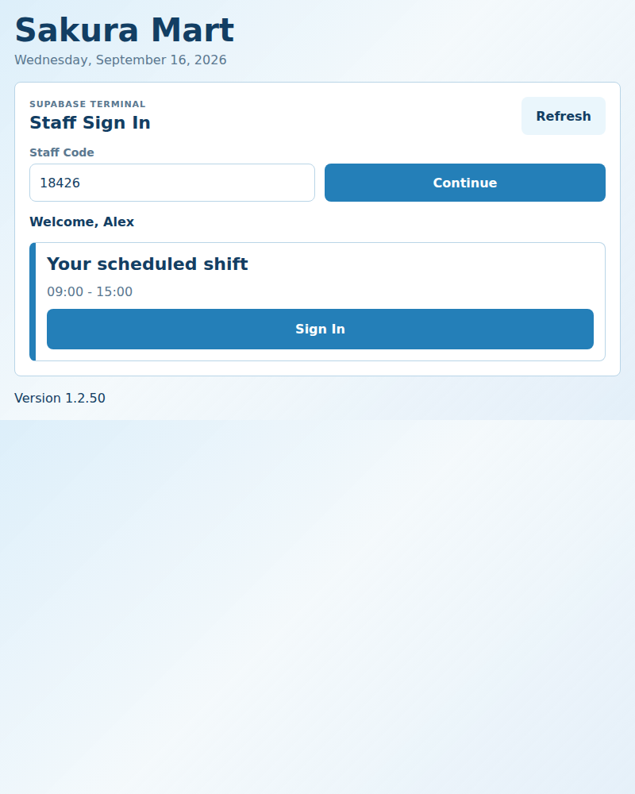
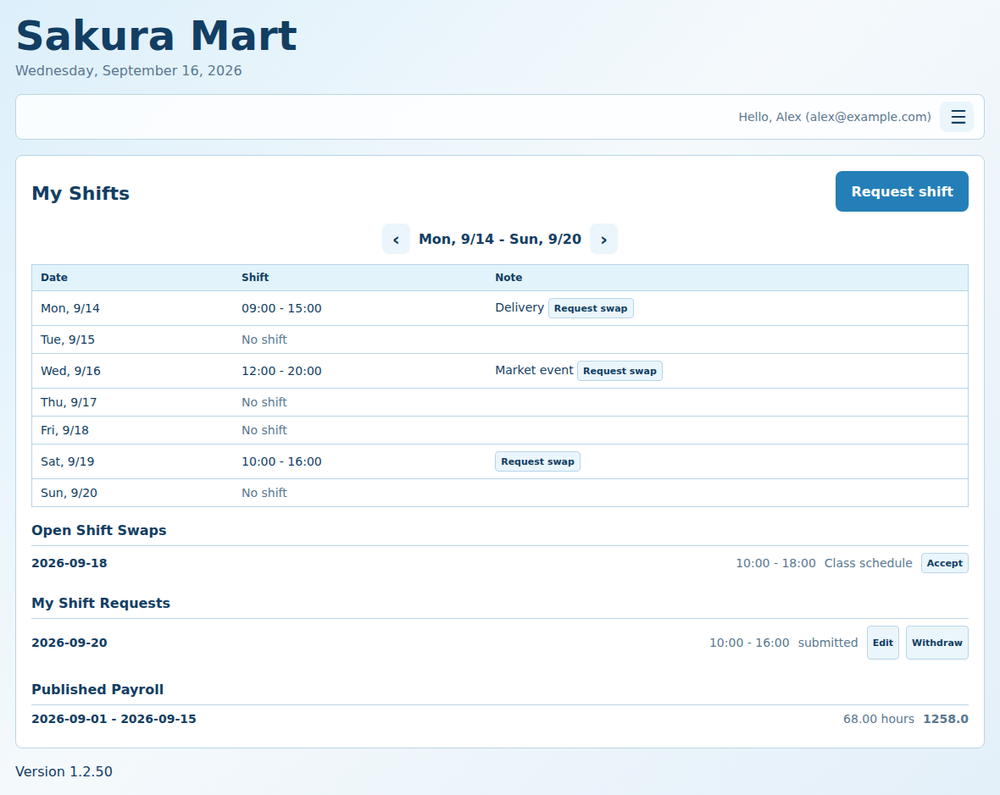
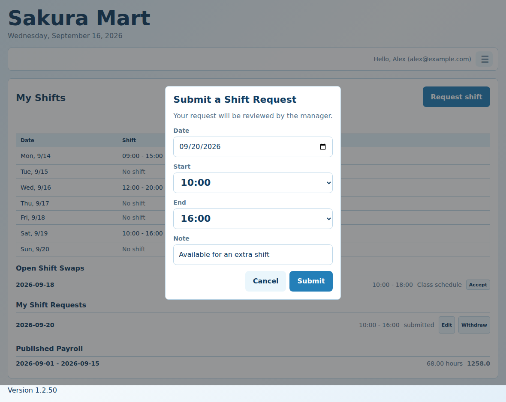
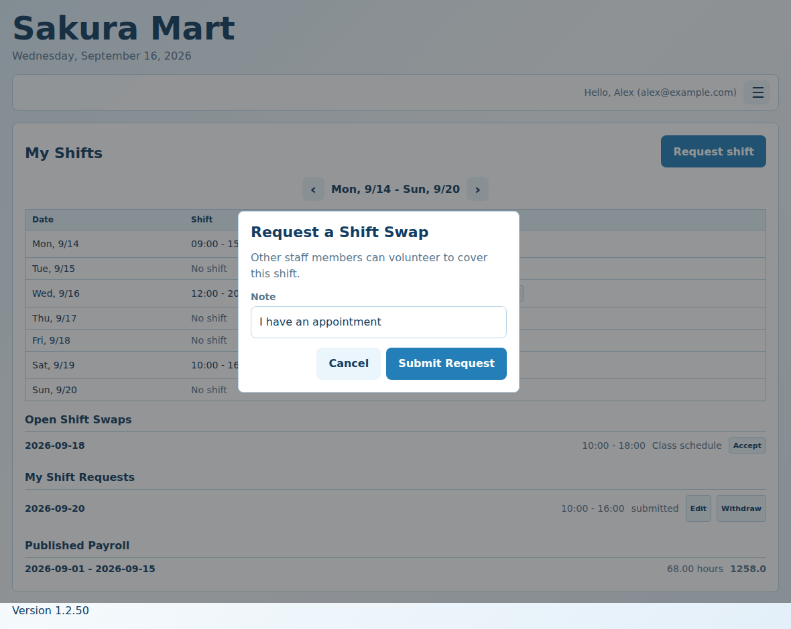
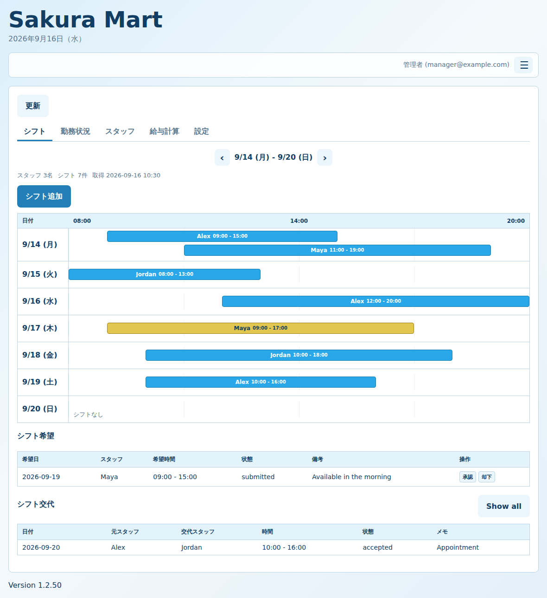
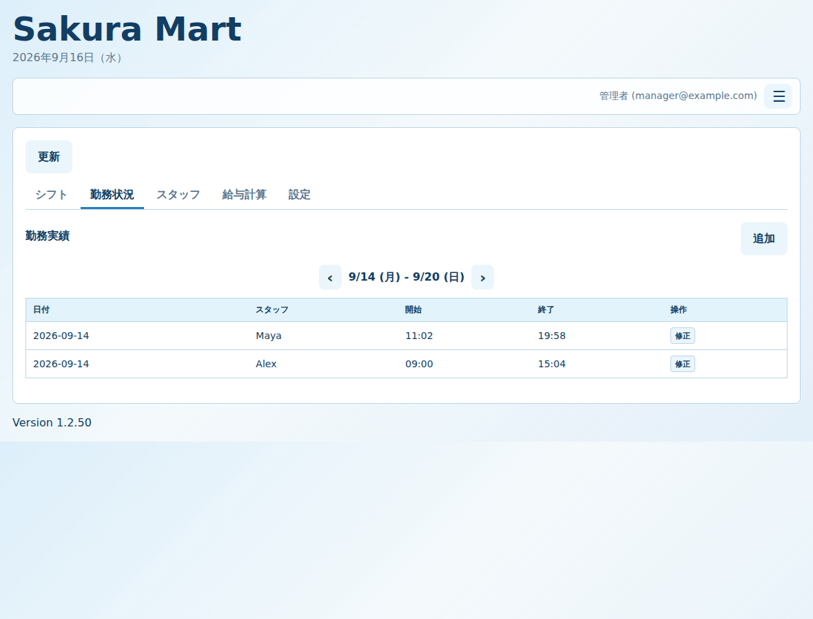
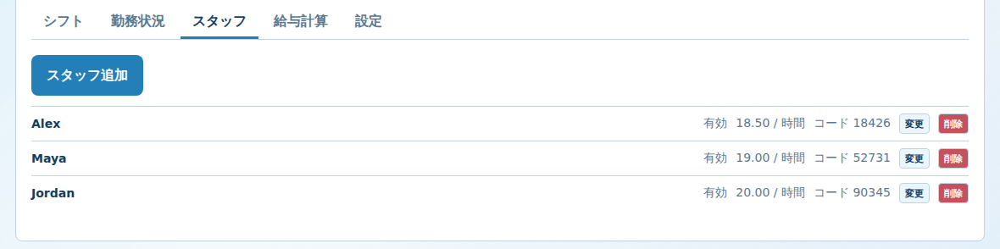
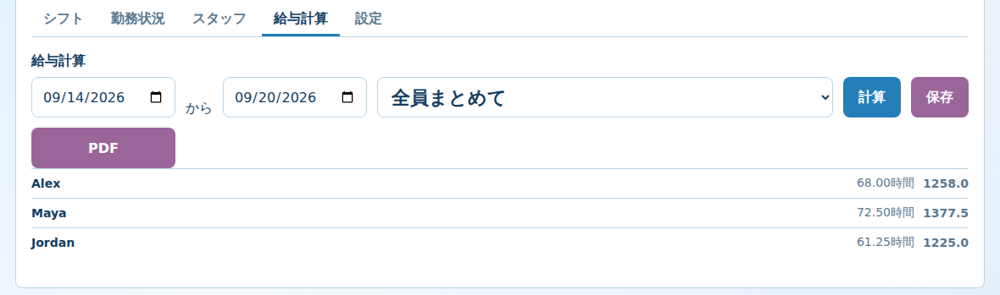
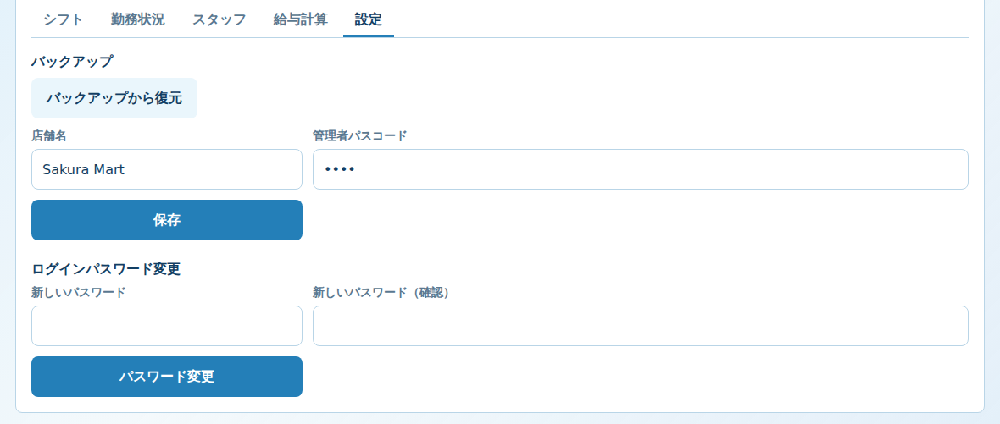

# Sakura Mart Timecard 現在の仕様・操作ガイド

最終更新: 2026-09-17
アプリバージョン: 1.2.53

この文書は、現在のコードで実際に動作する内容をまとめたものです。将来の予定は「未実装」と明記します。

オンライン時はService WorkerがHTML・JavaScript・CSSをネットワークから再検証します。新しいバージョンが公開されると、アプリを開いたとき、画面へ戻ったとき、または再読み込みしたときに更新を検出し、自動的に最新版へ切り替わります。利用者によるChromeのキャッシュ削除は不要です。オフライン時のみ、最後に正常取得したアプリをキャッシュから起動します。

掲載画像は操作説明用の架空データです。実在するスタッフ、メールアドレス、スタッフコード、給与ではありません。

## 1. アクセス先

GitHub PagesのURLに、次のクエリを付けて使い分けます。

| 用途 | URLの末尾 | 接続先 |
|---|---|---|
| 本番のオンライン画面 | URLそのまま | 本番Supabase |
| テストのオンライン画面 | `?mode=test` | テストSupabase |
| 本番の店舗打刻端末 | `?terminal=1` | 本番Supabase |
| テストの店舗打刻端末 | `?mode=test&terminal=1` | テストSupabase |
| 旧localStorage版を強制 | `?local=1` | AndroidまたはPCのlocalStorage |

本番とテストはデータベースが別です。テストで作成したスタッフ、シフト、打刻は本番には表示されません。

## 2. 画面の種類

### A. オンラインスタッフ・管理者画面

URLに `terminal=1` を付けない通常のURLです。最初に `Log in` が表示されます。

- スタッフ: Supabase Authのメールアドレスとパスワードでログイン
- 管理者: Supabase Authでmanager権限を持つメールアドレスでログイン
- スタッフは自分のシフト、シフト希望、交代申請、公開済み給与だけを表示
- 管理者は日本語の管理画面を表示
- この画面ではパンチイン・パンチアウトできない

### B. 店舗打刻端末

URLに `?terminal=1` を付けた画面です。Supabase Authのログインは不要です。

- 5桁のStaff Codeを入力
- 本日の自分の公開済みシフトだけを表示
- `Sign In` でパンチイン
- 勤務中は `Sign Out` でパンチアウト
- シフトがないスタッフは打刻できない
- 交代はオンライン画面で事前に確定しておく
- 店舗端末では交代相手を選択しない



店舗端末用URLでPWAをインストールすると、専用マニフェストの`start_url`により、PWA起動時も`?terminal=1`を保持します。テスト端末では`?mode=test&terminal=1`を保持します。通常版、店舗端末版、テスト店舗端末版は別のPWAとして識別されます。

以前の通常URLで登録されたPWAは自動では店舗端末版に変わりません。Pages更新後に古いPWAをアンインストールし、Chromeで`?terminal=1`付きURLを開いてインストールし直します。

### C. 旧localStorage版

個人GitHub Pages版など、Supabase設定がない環境、または `?local=1` で表示されます。

- データはその端末のブラウザ内だけに保存
- Staff Codeで打刻
- 旧来のManager画面と管理者パスコードを使用
- Supabaseのオンラインデータとは共有されない

## 3. 新しいスタッフの登録と初回ログイン

### 管理者が行うこと

1. 通常URLを開く
2. `Log in` から管理者アカウントでログイン
3. 管理画面の「スタッフ」タブを開く
4. 「スタッフ追加」を押す
5. 名前、時給、5桁スタッフコード、メールアドレスを入力
6. 「保存」を押す

ここで作成されるのは、アプリのスタッフ情報です。現在の実装では、管理者がスタッフを保存しただけでは招待メールは送信されません。

### スタッフ本人が行うこと

1. 通常URLを開く
2. `Log in` を押す
3. 下部の `Sign Up` を押す
4. 管理者が登録したメールアドレスと、6文字以上のパスワードを入力
5. `Sign Up` を押す
6. 表示される `A confirmation email was sent. Open the link, then log in.` はエラーではない
7. メールの確認リンクを開く
8. 通常URLへ戻り、同じメールアドレスとパスワードで `Log in`

通常URLの認証モーダルは、開くたびに `Log in` で開始します。初回アカウント作成時だけ、モーダル下部の `Sign Up` リンクで切り替えます。

サインアップ時に入力するメールアドレスが、管理者のスタッフ登録に保存されたメールアドレスと一致すると、ログイン時にスタッフ情報へ自動的に紐付けられます。

確認リンクの戻り先は、サインアップしたURLの場所になります。PagesでサインアップすればPagesへ戻り、localhostでサインアップすればlocalhostへ戻ります。

## 4. 管理者アカウントの追加

新しい店舗マネージャーをオンライン管理者として追加する場合の手順です。既存の管理者アカウントは削除せず、複数の管理者を登録できます。

### マネージャー本人が行うこと

1. `?terminal=1`や`?mode=test`を付けずに、通常の本番URLを開く
2. `Log in`を押す
3. モーダル下部の`Sign Up`を押す
4. 本人のメールアドレスと、本人が決めた6文字以上のパスワードを入力する
5. `Sign Up`を押す
6. Supabase Authから届いた確認メールのリンクを開く

`A confirmation email was sent. Open the link, then log in.`はエラーではなく、確認メールを送信した案内です。この段階ではAuthユーザーが作成されただけで、まだ管理画面には入れません。

### 開発担当者が行うこと

本番SupabaseのSQL Editorで次を実行します。メールアドレスはマネージャー本人のものへ変更してください。

```sql
insert into public.profiles (id, role, staff_id, active)
select
  id,
  'manager'::public.app_role,
  null,
  true
from auth.users
where lower(email) = lower('manager@example.com')
on conflict (id) do update set
  role = 'manager',
  staff_id = null,
  active = true;
```

続けて、登録結果を確認します。

```sql
select
  u.email,
  p.role,
  p.staff_id,
  p.active
from public.profiles p
join auth.users u on u.id = p.id
where lower(u.email) = lower('manager@example.com');
```

次の状態なら登録完了です。

```text
role: manager
staff_id: NULL
active: true
```

マネージャー本人が通常URLへ戻り、Sign Up時のメールアドレスとパスワードで`Log in`します。管理者はスタッフ登録、5桁Staff Code、staff_idを必要としません。

本番SupabaseとテストSupabaseのAuth・profilesは別管理です。テスト環境でも管理者にする場合は、`?mode=test`でSign Upし、テストSupabaseでも同じSQLを実行します。

### 管理者のログインパスワード

ログインできる管理者は、管理画面の「設定」→「ログインパスワード変更」で本人のパスワードを変更できます。新しいパスワードと確認用パスワードを入力します。これはSupabase Authの個人パスワードであり、店舗の管理パスコードとは別です。

ログインできない場合は、Log in画面の`Forgot password?`から登録メールアドレスを入力します。届いたメールのリンクを開き、`Set new password`画面で6文字以上の新しいパスワードを設定します。設定後は、新しいパスワードで改めてログインしてください。テスト環境のアカウントは`?mode=test`から、本番環境のアカウントは通常URLからリセットします。Edge Functionは使用せず、Supabase Auth標準のパスワード回復機能を使用します。

本人がログインできない場合、開発担当者はservice role keyをブラウザへ公開せず、安全なバックエンドまたはローカル管理スクリプトから`auth.admin.updateUserById()`を使ってパスワードを変更できます。`auth.users`をSQLで直接更新しません。

## 5. スタッフ画面の操作

スタッフでログインすると、画面は英語表示です。

上部には `Hello, 名前 (メールアドレス)` と表示されます。ログアウトは右側のハンバーガーメニューから行います。画面は30秒ごと、およびブラウザへ戻ったときに自動更新されるため、手動の `Refresh` ボタンはありません。



### シフト確認

- `My Shifts`: 自分の公開済みシフト
- 前後の矢印: 表示週を変更
- 表示中は30秒ごと、またブラウザへ戻ったときにSupabaseから自動更新
- `No shift`: その日に自分の公開済みシフトがない

### シフト希望



1. `Request shift` を押す
2. `Date`, `Start`, `End`, `Note` を入力
3. `Submit` を押す
4. `My Shift Requests` で状態を確認
5. `Edit` で、提出済みでまだ処理されていない希望を変更
6. `Withdraw` で、提出済みでまだ処理されていない希望を取り下げる

`My Shift Requests` は現在の週の月曜日以降の希望だけを表示します。過去週の希望は表示しません。

シフト希望の承認・却下は現在、管理者が管理画面で行います。承認すると、希望内容から公開シフトが自動作成され、シフト表に追加されます。

### シフト交代



1. 自分のシフト行にある `Request swap` を押す
2. 必要なら `Note` を入力
3. `Submit Request` を押す
4. 他スタッフがオンライン画面の `Open Shift Swaps` で `Accept` を押す
5. 先に受諾したスタッフが交代担当になります
6. 申請者は受諾前であれば `Cancel` で取り下げられます

現在は交代申請のメール通知は実装されていません。受けるスタッフはオンライン画面を開いて申請を確認する必要があります。

交代が確定すると、データベース上のシフト担当者が交代先スタッフへ変更されます。その後、店舗端末で交代先スタッフが自分のStaff Codeを入力すると、そのシフトに `Sign In` できます。

### 給与確認

スタッフ画面の `Published Payroll` には、管理者が公開した給与だけが表示されます。計算中、確定済み、未公開の給与は表示されません。スタッフ本人による給与明細PDFの保存は現在未実装です。

### スタッフができないこと

- 店舗端末以外からのパンチイン・パンチアウト
- 他スタッフのシフト、給与、メールアドレス、時給の閲覧
- 管理者画面へのアクセス

## 6. 管理者画面の操作

管理者でログインすると、画面は日本語表示です。タブは次の順番です。

`シフト` / `勤務状況` / `スタッフ` / `給与計算` / `設定`

### シフト



- 前後の矢印で週を変更
- 月曜日から日曜日までを一覧表示
- シフトは日ごとに1行の8:00〜20:00タイムラインで表示
- バーを押すとそのシフトを変更
- 「シフト追加」で日付、スタッフ、開始、終了、備考、状態を入力
- 状態は「下書き」または「公開」
- スタッフと店舗端末に表示されるのは「公開」のシフト
- 既存行の「変更」で編集
- 「シフト希望」でスタッフの希望を確認し、「承認」または「却下」
- 「シフト交代」で交代申請の状態を確認
- 交代申請は通常、今週以降のものだけを表示
- `Show all` で過去分を含むすべての交代申請を表示
- 交代申請一覧には元スタッフと、確定済みの場合は交代スタッフを表示

### 勤務状況



- 前後の矢印で対象週を切り替え
- 週の打刻実績を確認
- 打刻の追加・変更
- 開始・終了は1分単位
- 通常の早着は予定シフト開始時刻から給与計算
- 「早出として実打刻の開始時刻から給与計算」を有効にした記録だけ、実際の開始時刻から計算
- 終了時刻がない記録は勤務中

### スタッフ



- スタッフ追加
- 名前、時給、5桁スタッフコード、メールアドレスの編集
- スタッフコードの表示
- 「削除」は論理削除で、activeをfalseにするだけ
- 論理削除後も、過去のシフト・打刻・給与データは残る
- 「有効化」で再び利用可能にできる

### 給与計算



1. 開始日と終了日を指定
2. 全スタッフ、または対象スタッフを選択
3. 「計算」を押す
4. 結果を画面で確認
5. スタッフごとの「確定」で計算結果を確定
6. スタッフごとの「公開」で、スタッフ本人の画面へ公開
7. 「保存」でGoogleスプレッドシートで開けるCSVを出力
8. 「PDF」でA4縦の給与明細を出力

給与は打刻実績から毎回計算されます。金額は小数第1位で四捨五入します。「確定」だけではスタッフに表示されず、「公開」した給与だけがスタッフ画面に表示されます。

### 設定



- バックアップ関連の操作は設定タブの一番下に表示
- 「完全バックアップ保存」で、現在のオンライン業務データをJSONファイルとして端末へ保存
- 対象はスタッフ、スタッフコード、シフト、打刻、給与データ、店舗名、管理者パスコード、シフト希望、交代申請
- 「バックアップから復元」で、オンライン版または旧localStorage版のJSONバックアップを取り込む
- 旧バックアップにシフト希望・交代申請が存在しなくてもエラーにせず処理を続ける
- 復元前に現在の業務データを削除し、バックアップ内容へ置き換える
- 復元には、ログイン中管理者のSupabase Authログインパスワードが必要
- パスワード確認後にも、全置換を実行する最終確認ダイアログを表示
- Authユーザー、パスワード、管理者プロフィール、DB構造は削除しない
- 既存スタッフのAuthプロフィールとの紐付けは、バックアップ内に同じスタッフIDがある場合に復旧
- 復元前に現在のデータを別途バックアップする
- 店舗名を保存すると、見出しとブラウザのタイトルに反映される
- Supabaseの `app_settings` テーブルが必要
- 「ログインパスワード変更」で、ログイン中の管理者本人のSupabase Authパスワードを変更
- ログインパスワードは6文字以上で、店舗の管理パスコードとは別管理

## 7. データ保存先

| 画面 | 保存先 |
|---|---|
| オンラインスタッフ・管理者画面 | 接続先Supabase |
| `?terminal=1` の店舗端末 | 接続先Supabase |
| 旧localStorage版 | 使用中端末のブラウザlocalStorage |

同じPages URLでも、`?mode=test` の有無でDBが変わります。テストデータが本番に出ない、または本番データがテストに出ないのは正常です。

## 8. Supabaseで必要なSQL

本番・テストの両方で、次のマイグレーションを番号順に一度ずつ実行します。

```text
202609110001_initial_online_schema.sql
202609110002_data_api_grants.sql
202609110003_payroll_period_unique.sql
202609110004_remove_closed_shift_status.sql
202609110005_staff_codes.sql
202609120001_shift_swap_access.sql
202609140001_self_service_staff_registration.sql
202609150001_terminal_access.sql
202609150002_public_terminal_rpc.sql
202609150003_backup_settings.sql
```

特に次が未実行だと、対応する機能が動きません。

| SQL | 必要な機能 |
|---|---|
| `202609120001_shift_swap_access.sql` | シフト交代の受諾・先着処理 |
| `202609150002_public_terminal_rpc.sql` | Authなしの店舗端末打刻 |
| `202609150003_backup_settings.sql` | 店舗名、管理者パスコード、バックアップ設定 |

`public.app_settings` が未作成でも、現在のアプリは設定以外の管理画面を表示できます。ただし店舗名保存とバックアップ設定の保存には、このSQLが必要です。

## 9. 現在未実装の機能

- スタッフ本人による公開済み給与明細のPDF保存
- シフト交代申請の一斉メール通知
- メール本文のボタンから直接交代を受諾する機能
- 新規スタッフ追加時の自動招待メール
- 旧localStorage版とオンライン版の自動同期
- オンライン端末の厳密な端末登録・キオスク制御

現状、新規スタッフのメールはスタッフ本人が `Sign Up` を実行したときにSupabase Authから送信されます。管理者がスタッフ情報を保存しただけでは送信されません。

## 10. 動作確認時の確認順序

### テスト環境

1. `?mode=test` を付けたURLを開く
2. テストSupabaseに管理者Authユーザーが存在することを確認
3. `profiles.role = 'manager'`、`active = true` を確認
4. 管理者でログイン
5. スタッフを追加
6. スタッフ本人が `Sign Up`
7. 確認メールのリンクを開く
8. スタッフでログイン
9. シフト希望・交代申請を確認
10. `?mode=test&terminal=1` でStaff Code打刻を確認

### 本番環境

テスト環境で確認が完了してから、同じ手順を本番URLで行います。本番URLでのテスト操作は本番データを変更します。

## 11. 既知の表示・通信トラブル

### `A confirmation email was sent...`

サインアップ成功後に表示する案内であり、エラーではありません。メールの確認リンクを開いてからログインします。

### `Staff code not found`

- URLに `?terminal=1` が付いているか確認
- 本番スタッフなら本番URL、テストスタッフなら `?mode=test` を使用
- Staff Codeが5桁の数字か確認
- スタッフがactiveか確認
- その環境のSupabaseにスタッフコードが保存されているか確認

### `Could not find the table 'public.app_settings' in the schema cache`

対象Supabaseで `202609150003_backup_settings.sql` を実行します。現在のアプリは設定テーブルが未作成でも管理画面を表示できますが、設定保存にはSQL適用が必要です。

### 古い画面が表示される

1. GitHub ActionsのPagesデプロイ成功を確認
2. ブラウザで強制再読み込み
3. PWAを終了して再起動
4. フッターのバージョンを確認

## 12. 現在の検証結果

2026-09-17時点で、ローカルの自動テスト28件と本番ビルドが成功しています。Supabaseの本番・テストプロジェクトに対する実データ操作は、各プロジェクトで必要なSQLが適用済みかどうかに依存します。

## 13. マニュアル画像の更新

画面デザインや表示項目を変更した場合は、リポジトリ直下で次を実行します。

```bash
npm run docs:screenshots
```

画像は `docs/images/current-operation-guide/` に上書き生成されます。撮影ページは固定の架空データを使用し、Supabaseには接続しません。初回だけPlaywrightのChromiumが必要です。

```bash
npx playwright install chromium
```
